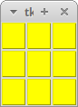
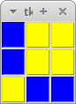

# Lights Out

Lights Out is game based on simple concept. Clicking on a cell toggles that cell and each of its immediate neighbors. The goal is to turn out all the lights, ideally with the minimum number of clicks.

## Requirements

It is necessary to install the tkinter package.

`sudo apt install python3-tkinter`

## How to run

`python lights_out.py`
