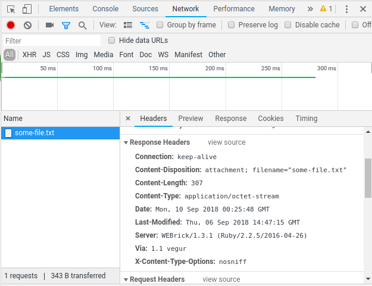

# Download file using selenium

## Problem

Crawl a website and download some content using firefox headless.


## Discuss

Before you ask me why use selenium at this example. this example is only a reproducible case of a more complex crawler.

when you click in a downlodable link, we should observe reponses content-type.



These lines are responsible to configure the current folder as place where files are placed.
Last line tells to the browser to don't ask before download some content-type(A list can be passed here).

```python
profile.set_preference('browser.download.folderList', 2)
profile.set_preference('browser.download.dir', os.getcwd())
profile.set_preference('browser.helperApps.neverAsk.saveToDisk',
                       'application/octet-stream')
```

## How to run

build docker image:

`docker build -t crawl .`

run:

`docker run --rm -v $PWD:/app crawl`
